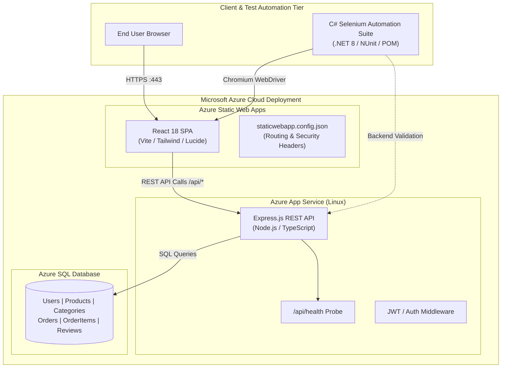
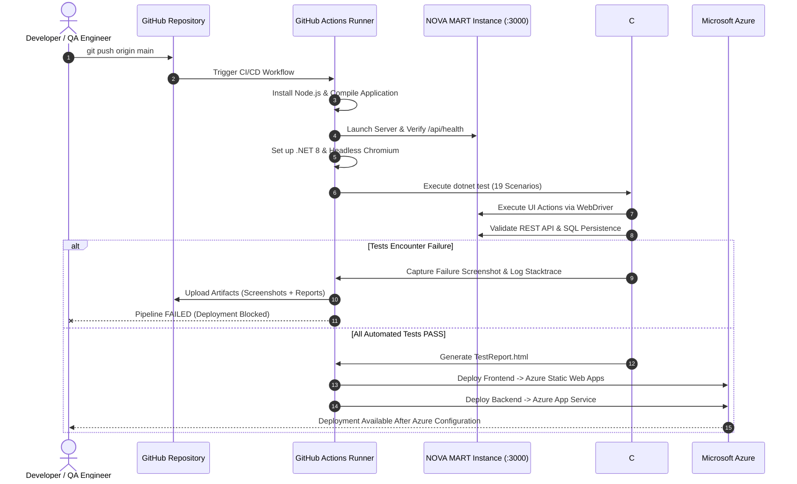

# NOVA MART • Full-Stack E-Commerce & Automated QA Platform


**NOVA MART** is a full-stack e-commerce web platform developed alongside an automated **Quality Assurance (QA) and Continuous Integration/Continuous Delivery (CI/CD)** framework.

Built to demonstrate full-stack development and software testing capabilities, the platform combines a responsive React/TypeScript single-page application and Express SQL backend with a **C# .NET 8 / Selenium WebDriver / NUnit Page Object Model (POM)** test automation suite, supported by GitHub Actions CI/CD and Azure deployment configuration.

---

## Table of Contents

1. [Architecture Overview](#architecture-overview)
2. [Mermaid Architecture Diagram](#mermaid-architecture-diagram)
3. [Technology Stack](#technology-stack)
4. [Automated QA & Testing Strategy](#automated-qa--testing-strategy)
5. [C# Selenium Automation Framework](#c-selenium-automation-framework)
6. [Page Object Model (POM) Design](#page-object-model-pom-design)
7. [Automated Test Suite Catalog (19 Scenarios)](#automated-test-suite-catalog-19-scenarios)
8. [CI/CD Pipeline (GitHub Actions)](#cicd-pipeline-github-actions)
9. [Mermaid CI/CD Pipeline Diagram](#mermaid-cicd-pipeline-diagram)
10. [Azure Cloud Deployment Guide](#azure-cloud-deployment-guide)
11. [How to Run Tests Locally & In Headless Mode](#how-to-run-tests-locally--in-headless-mode)
12. [Why This Project Demonstrates QA Engineering Skills](#why-this-project-demonstrates-qa-engineering-skills)

---

## Architecture Overview

NOVA MART employs a multi-tier architecture designed for testability, maintainability, and automated verification:

* **Presentation Layer:** React 18 SPA built with Vite, TypeScript, and Tailwind CSS. Employs client-side routing, responsive layouts, motion interactions, cart state synchronization, and explicit `data-testid` DOM hooks for resilient test targeting.
* **Application / API Tier:** Node.js & Express RESTful backend providing endpoints for authentication, catalog querying, search debouncing, cart management, checkout processing, order history, and health probes (`/api/health`).
* **Persistence Tier:** Structured SQL database using SQLite for local development and testing, with seed data and migration support. Azure SQL Database deployment schemas and configuration are also included for cloud deployment.
* **Automated QA Layer:** .NET 8 C# test suite utilizing Selenium WebDriver 4 and NUnit 3, abstracting UI components through the Page Object Model (POM), featuring dynamic explicit waits, automatic failure screenshot capture, backend API verification, and standalone HTML report generation.
* **DevOps & Cloud:** GitHub Actions workflow for automated build and testing, with Azure Static Web Apps, Azure App Service, and database deployment configuration prepared for cloud deployment.

---

## Mermaid Architecture Diagram



---

## Technology Stack

| Layer                              | Technologies                                                                                   |
| :--------------------------------- | :--------------------------------------------------------------------------------------------- |
| **Frontend UI**                    | React 18, TypeScript, Vite, Tailwind CSS, Lucide React, Motion                                 |
| **Backend API**                    | Node.js, Express.js, RESTful API Design, JWT, Bcrypt                                           |
| **Database**                       | SQL, SQLite (Local Development & Testing), Azure SQL Database (Cloud Deployment Configuration) |
| **Automation Language**            | C# (.NET 8.0 SDK)                                                                              |
| **Test Automation**                | Selenium WebDriver 4.x, Selenium Support, WebDriverManager                                     |
| **Test Runner & Framework**        | NUnit 3.x, NUnit3TestAdapter, Microsoft.NET.Test.Sdk                                           |
| **Architecture Pattern**           | Page Object Model (POM), Factory Pattern, Helper Utilities                                     |
| **Reporting & Diagnostics**        | Custom Responsive HTML Test Report, Automated Screenshot Capture                               |
| **CI/CD**                          | GitHub Actions (Ubuntu Runners, Docker, Node.js + .NET Matrix)                                 |
| **Cloud Deployment Configuration** | Azure Static Web Apps, Azure App Service, Azure SQL                                            |

---

## Automated QA & Testing Strategy

A major challenge in automated web testing is test flakiness caused by timing variations, brittle selectors, and inconsistent test execution. NOVA MART addresses these challenges through:

1. **Dedicated Test Attributes (`data-testid`):** Interactive DOM elements are tagged with stable `data-testid` selectors (e.g., `data-testid="login-email"`, `data-testid="add-to-cart"`, `data-testid="place-order"`). Tests avoid relying on volatile styling classes or dynamic layout tags.
2. **Strict Explicit Wait Policy:** The framework uses Selenium `WebDriverWait` and polling predicates to ensure DOM elements are rendered, visible, and interactable before actions execute.
3. **Automated Defect Diagnostics:** Base test lifecycle hooks inspect NUnit test outcome statuses. On assertion failure, a PNG screenshot is captured, time-stamped, attached to NUnit's `TestContext`, and included in the HTML reporting workflow.
4. **Hybrid UI + Backend Cross-Verification:** In addition to verifying front-facing UI state transitions, the regression suite uses backend REST API verification (`ApiHelper.VerifyOrderExistsAsync`) to verify transaction persistence.

---

## C# Selenium Automation Framework

The framework is located under `/automation` and structured into distinct layers:

```text
automation/
├── NovaMart.Tests.csproj       # .NET 8 test project definition & NuGet packages
├── Pages/                      # Page Object Model representations
│   ├── BasePage.cs             # Global navigation, headers, and search triggers
│   ├── LoginPage.cs            # Authentication modal & validation alerts
│   ├── HomePage.cs             # Hero actions, banners & featured catalog
│   ├── ShopPage.cs             # Catalog filters, debounce search, sorting, sliders
│   ├── ProductPage.cs          # Quantity selectors, add-to-cart, wishlist
│   ├── CartPage.cs             # Quantity increments, line totals, item removal
│   ├── CheckoutPage.cs         # Form inputs, field validation, order placement
│   ├── OrderConfirmationPage.cs# Generated order numbers & status verification
│   └── AccountPage.cs          # Customer profile, tab navigation, order history
├── Tests/                      # Modular test fixtures
│   ├── AuthenticationTests.cs  # TC01, TC02, TC03
│   ├── SearchAndCatalogTests.cs# TC04, TC05, TC06, TC07, TC08, TC09, TC14
│   ├── CartManagementTests.cs  # TC10, TC11, TC12, TC13
│   ├── CheckoutAndOrderTests.cs# TC15, TC16, TC17, TC18
│   └── RegressionSuite.cs      # TC19 (Complete E2E cross-stack regression)
├── Utilities/                  # Reusable infrastructure
│   ├── DriverFactory.cs        # Multi-browser creation (Chrome, Firefox, Edge, Headless)
│   ├── BaseTest.cs             # NUnit SetUp, TearDown, Screenshot hooks & Reporting
│   ├── WaitHelper.cs           # Robust explicit wait abstractions
│   ├── ScreenshotHelper.cs     # Automated screenshot capture & disk storage
│   ├── TestDataHelper.cs       # Strongly-typed test data fixtures & fallback constants
│   ├── ApiHelper.cs             # REST backend / database verification client
│   └── HtmlReportHelper.cs     # Responsive execution summary report generator
├── TestData/
│   └── testdata.json           # Parameterized test data (users, queries, addresses)
├── Reports/
│   └── TestReport.html         # Generated interactive HTML execution report
└── Screenshots/                # Artifact storage for test failure captures
```

---

## Page Object Model (POM) Design

The framework implements the **Page Object Model** design pattern:

* **Separation of Concerns:** Test files contain assertions and business logic; element locators and UI interaction logic reside within Page classes.
* **Encapsulation:** Elements are encapsulated behind clean public methods (e.g., `_shopPage.Search("NovaPods")`, `_cartPage.ProceedToCheckout()`, `_checkoutPage.FillShippingDetails(...)`).
* **Maintainability:** If a UI element changes, the corresponding locator can be updated within its Page Object rather than across every test.

---

## Automated Test Suite Catalog (19 Scenarios)

|    ID    | Test Scenario                 | Category         | Description & Verification                                                                                                            |
| :------: | :---------------------------- | :--------------- | :------------------------------------------------------------------------------------------------------------------------------------ |
| **TC01** | **Valid Login**               | Authentication   | Logs in with valid credentials; asserts user menu and profile state appear.                                                           |
| **TC02** | **Invalid Login**             | Authentication   | Submits incorrect password; verifies error banner and authentication rejection.                                                       |
| **TC03** | **Empty Login Validation**    | Authentication   | Submits empty form; asserts validation guards prevent submission.                                                                     |
| **TC04** | **Product Search**            | Search & Catalog | Searches for `"NovaPods"`; verifies debounce trigger and filtered cards.                                                              |
| **TC05** | **Search With No Results**    | Search & Catalog | Searches for non-existent query; asserts `"no-products-found"` banner.                                                                |
| **TC06** | **Category Filtering**        | Search & Catalog | Clicks `"electronics"`; verifies displayed items match category.                                                                      |
| **TC07** | **Price Filtering**           | Search & Catalog | Adjusts max price slider; verifies all rendered items comply with ceiling.                                                            |
| **TC08** | **Product Sorting**           | Search & Catalog | Toggles Price Low→High vs High→Low; verifies ascending/descending order.                                                              |
| **TC09** | **Open Product Details**      | Search & Catalog | Clicks product card; verifies navigation to `/product/:id` and specs render.                                                          |
| **TC10** | **Add Product to Cart**       | Cart Management  | Adds item from catalog; verifies header badge count increments.                                                                       |
| **TC11** | **Increase Quantity**         | Cart Management  | Clicks `+` in cart; verifies quantity updates and subtotal increases.                                                                 |
| **TC12** | **Decrease Quantity**         | Cart Management  | Clicks `-` in cart; verifies quantity decrements accurately.                                                                          |
| **TC13** | **Remove Product**            | Cart Management  | Clicks remove trash icon; verifies item removal and empty state rendering.                                                            |
| **TC14** | **Add Product to Wishlist**   | Search & Catalog | Toggles heart icon; verifies favorite state persisted.                                                                                |
| **TC15** | **Checkout Form Validation**  | Checkout         | Submits empty checkout; verifies required shipping field validation.                                                                  |
| **TC16** | **Successful Checkout**       | Checkout         | Fills shipping information and confirms order placement.                                                                              |
| **TC17** | **Order Confirmation**        | Checkout         | Asserts order success view, tracking stepper, and unique `ORD-*` ID.                                                                  |
| **TC18** | **Order History**             | Account          | Navigates to account orders tab; verifies placed order is present.                                                                    |
| **TC19** | **Full E2E Regression Suite** | Regression       | Complete end-to-end journey: Login → Search → Detail → Cart → Checkout → Confirm → **Backend API / DB Verification** → Order History. |

---

## CI/CD Pipeline (GitHub Actions)

The workflow is defined in `.github/workflows/test-and-deploy.yml` and provides an automated build and quality-gate workflow:

1. **Trigger:** Push or Pull Request to the `main` branch.
2. **Build Stage:**

   * Checks out code on `ubuntu-latest`.
   * Sets up Node.js 20, installs dependencies, and runs TypeScript linting.
   * Compiles the frontend Vite build and backend server bundle.
   * Spawns the application service in the background and polls `/api/health`.
3. **Automated Test Stage:**

   * Sets up .NET 8 SDK and installs Google Chrome.
   * Restores C# dependencies via `dotnet restore`.
   * Executes the 19 automated Selenium scenarios in headless mode:

     ```bash
     dotnet test automation/NovaMart.Tests.csproj --configuration Release --logger "trx"
     ```
   * Generates and archives the responsive `TestReport.html` artifact.
   * Automatically captures and uploads failure screenshots if any test fails (`if: failure()`).
4. **Deployment Stage:**

   * The workflow includes deployment configuration for Azure Static Web Apps and Azure App Service.
   * Cloud deployment is intended to run after the automated quality checks pass successfully.
   * Azure deployment requires the corresponding Azure resources, credentials, and repository secrets to be configured.

---

## Mermaid CI/CD Pipeline Diagram



---

## Azure Cloud Deployment Guide

### 1. Azure Static Web Apps (Frontend)

* Create an Azure Static Web App in the Azure Portal.
* Set Build Details:

  * App location: `/`
  * Output location: `dist`
  * API location: (leave blank)
* Store the deployment token in GitHub Repository Secrets as `AZURE_STATIC_WEB_APPS_API_TOKEN`.
* The included `staticwebapp.config.json` handles Single Page App routing fallbacks and HTTP security headers.

### 2. Azure App Service (Backend)

* Create an Azure App Service instance running Node.js 20 LTS (or Docker container using the included multi-stage `Dockerfile`).
* Configure Environment Variables:

  * `NODE_ENV=production`
  * `PORT=3000`
  * `DATABASE_URL` (Connection string to Azure SQL Database)
* Set GitHub Repository Secret `AZURE_APP_SERVICE_PUBLISH_PROFILE`.

### 3. Azure SQL Database

* Run the migration script located at `/database/azure_sql_migration.sql` (or `/server/database/azure_sql_schema.sql`) against your Azure SQL instance.
* Indexes on `Products.CategoryId`, `Products.Price`, and `Orders.UserId` are included in the database deployment configuration.

---

## How to Run Tests Locally & In Headless Mode

### Prerequisites

* **.NET 8.0 SDK** ([Download](https://dotnet.microsoft.com/download/dotnet/8.0))
* **Google Chrome** browser installed
* **Node.js 18+**

### Step 1: Start the NOVA MART Application

```bash
# In the root repository directory
npm install
npm run dev
# Confirm the app is live at http://localhost:3000
```

### Step 2: Run Automated Tests

#### Option A: Headless Mode (Standard / CI Default)

```bash
cd automation
dotnet test --filter "Category=Regression"
# Or run the entire test suite:
dotnet test
```

#### Option B: Headed Mode (Watch Browser Interactions)

To view the browser execute clicks, typing, and transitions visually on your desktop:

```bash
# On Linux / macOS
HEADLESS=false dotnet test

# On Windows (PowerShell)
$env:HEADLESS="false"; dotnet test
```

#### Option C: Target a Different Environment / Port

```bash
BASE_URL="https://staging.novamart.yourdomain.com" HEADLESS=true dotnet test
```

### Step 3: View Test Reports & Failure Screenshots

* Test Execution Report: Open `automation/Reports/TestReport.html` in any web browser.
* Failure Screenshots: If any test fails, PNG images are saved directly in `automation/Screenshots/`.

---

## Why This Project Demonstrates QA Engineering Skills

1. **Test Architecture:** Demonstrates practical implementation of the **Page Object Model (POM)** in C# .NET, with reusable page classes, explicit waits, and centralized test utilities.
2. **Defect Prevention Through Automation:** Covers critical user workflows including registration/login, product search, cart operations, checkout validation, and post-order verification.
3. **Full-Stack Cross-Validation:** Combines functional UI testing with backend REST and SQL validation to verify application state across layers.
4. **DevOps & Quality Gates:** Uses GitHub Actions to automate application build and testing, with deployment configuration for Azure environments.
5. **Observability & Triage Efficiency:** Generates HTML test reports, execution timings, and failure screenshot artifacts to support defect analysis and troubleshooting.
